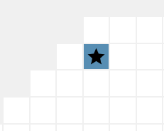
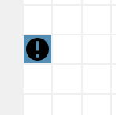

Debugging your robot
=====================

Logging in RR occurs on two levels.

1. **Turn-wide info**: Calling the standard ``print``/``console.log`` function will immediately spit out your logs regardless of which robot they came from. You can view them in the bottom-right panel of the webview, or in the terminal output of rumblebot.
2. **Robot-specific info**: If you need to view information specific to individual units, you have a better option: :class:`Debug`. This class is dedicated to giving the programmer easy access to the webapp GUI, which is currently the only way to inspect robot-specific information. :func:`Debug.inspect` allows you to create a table with custom values, and :func:`Debug.locate` gives you an easy way to locate a robot in the map. You can access these methods through a global ``debug`` variable.

Errors behave in a somewhat similar way. Initialization-level errors (like syntax errors) are fatal to your program, and so their output is placed in the same place as turn-wide logs. Runtime errors, on the other hand, occur locally to each robot function invocation, so they are placed in a similar space as the robot-specific info.

Robots identified with :func:`Debug.locate` have a star:

Robots that have experienced a runtime error have a warning sign:

Note that the star label takes precedence over the warning label, so if an errored robot is identified, then only the star will be shown.
