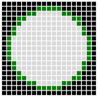
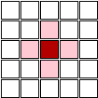
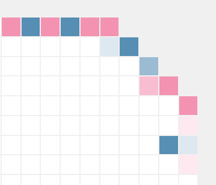

Welcome to the RR docs!
=======================

.. toctree::
    :hidden:

    quickstart
    publishing
    debugging
    api
    rumblebot
    technical-details

In Robot Rumble, you develop robots that fight in one-vs-one arena battles. We currently support Python and Javascript, but more languages are planned. A very basic robot program looks like this:

.. content-tabs::

    .. tab-container:: tab1
        :title: Python

        .. code-block:: python

            def robot(state, unit):
                if state.turn % 2 == 0:
                    return Action.move(Direction.East)
                else:
                    return Action.attack(Direction.South)

    .. tab-container:: tab2
        :title: Javascript

        .. code-block:: javascript

            function robot(state, unit) {
              if (state.turn % 2 === 0) {
                return Action.move(Direction.East)
              } else {
                return Action.attack(Direction.South)
              }
            }

You write a program for an individual robot, and then, every turn, that program is run for every robot on your team. Global state is allowed, so how you make your robots work together is entirely up to you.

Robots fight in a 19x19 circular arena. In the picture below, dark squares are the wall, and green squares are spawn points. Every **10** turns, any robots still left in the spawn area are removed, and a batch of up to **4** robots randomly spawns for each team.

Every turn, a robot can either **move** or **attack** in one of four directions.

Every robot starts out with **5 HP**, and attacks do **1 damage**. There is no collateral damage, but there is friendly fire. If more than one robot moves into the same location, priority is given in a clockwise order starting from the North.

The health is represented by the shade of the robot. The blue and red squares in this image are robots on the two opposing teams of an actual game:

If you have more robots in the arena after **100** turns, you win!

 * Jump into the game by :doc:`creating your first robot <quickstart>`
 * Learn more about :doc:`publishing your robot <publishing>`
 * Discover the tools available for :doc:`debugging your robot <debugging>`
 * Browse the :doc:`API <api>`
 * Learn about using the :doc:`CLI tool <rumblebot>`
 * Geek out over the :doc:`technical details <technical-details>`
